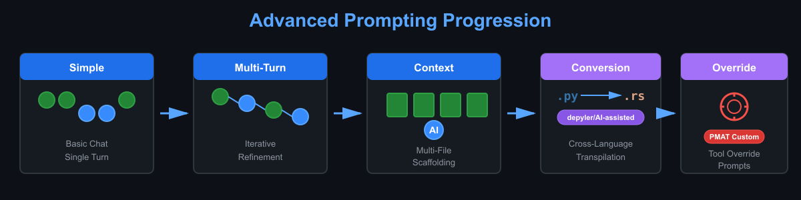

<h1 align="center">Advanced Prompting with GitHub Copilot</h1>
<h5 align="center">Master the art of crafting effective prompts and conversational interactions with GitHub Copilot</h3>

<p align="center">
  
</p>

<p align="center">
  <a href="https://github.com/paiml/advanced-prompting-with-github-copilot/actions/workflows/ci.yml">
    
  </a>
  <a href="https://github.com/paiml/advanced-prompting-with-github-copilot">
    
  </a>
  <a href="https://github.com/paiml/advanced-prompting-with-github-copilot">
    
  </a>
</p>

<p align="center">
  <a href="#-about-this-course">About</a> •
  <a href="#-learning-objectives">Learning Objectives</a> •
  <a href="#-course-modules">Modules</a> •
  <a href="#-labs">Labs</a> •
  <a href="#-resources">Resources</a>
</p>

---

**📚 Course 1 of the GitHub Copilot Mastery Pathway**
⏱️ *Duration: ~60 minutes*

## 📖 About This Course

## Overview

Welcome to "Advanced Prompting with GitHub Copilot"! This course is the first in the GitHub Copilot Mastery Pathway, designed to elevate your GitHub Copilot skills from basic completions to advanced conversational interactions. You'll learn how to craft effective multi-turn prompts, refine your requests iteratively, and work with complex codebases across multiple files. By mastering these techniques, you'll dramatically improve your productivity and code quality.

## 🎯 Learning Objectives

By the end of this course, you will be able to:

* ✅ Transition from basic autocomplete to conversational interactions with GitHub Copilot
* ✅ Understand and leverage different chat input methods and modes
* ✅ Craft effective multi-turn prompts for complex coding tasks
* ✅ Apply iterative refinement techniques to improve code quality
* ✅ Provide context from multiple files to enhance Copilot's accuracy
* ✅ Leverage open files strategically for better code suggestions
* ✅ Generate implementation code from API documentation
* ✅ Navigate and understand unfamiliar codebases efficiently

## 📚 Course Modules

### Module 1: Foundations for Advanced Prompting
- Introduction to the course and learning pathway
- Transitioning from basic to conversational AI
- Understanding the power of multi-turn interactions
- Overview of chat inputs and interaction methods
- Overview of chat modes (inline, chat, and editor)

### Module 2: Mastering Conversational AI
- 💬 Crafting effective multi-turn prompts
- 🔄 Iterative refinement techniques for code improvement
- 🎯 **Challenge**: Refactor with conversation
- ✅ **Solution**: Refactor with conversation
- 📊 Analyzing your conversational approach

### Module 3: Advanced Context Scaffolding
- 📂 Providing context from multiple files
- 🎯 Leveraging open files for accuracy
- 🎯 **Challenge**: Generate code from API docs
- ✅ **Solution**: Generate code from API docs
- 🔍 Working with unknown codebases

## 🧪 Labs

This course includes hands-on labs organized by module to reinforce your learning. Each lab provides practical experience with the concepts covered in the videos.

### Module 1 Labs: Foundations for Advanced Prompting
* [Lab 1: Getting Started with Conversational Prompting](labs/module1/1-conversational-prompting-lab.md)
* [Lab 2: Mastering Multi-Turn Interactions](labs/module1/2-multi-turn-interactions-lab.md)

### Module 2 Labs: Mastering Conversational AI
* [Lab 3: Iterative Refinement Practice](labs/module2/3-iterative-refinement-lab.md)

### Module 3 Labs: Advanced Context Scaffolding
* [Lab 4: Multi-File Context Management](labs/module3/4-multi-file-context-lab.md)
* [Lab 5: Documentation Generation and Code Creation](labs/module3/5-docs-and-code-generation-lab.md)
* [Lab 6: Exploring Unknown Codebases](labs/module3/6-exploring-codebases-lab.md)

### 🏆 Bonus Exercises: Advanced Applications
* **[Bonus 1: Python to Rust CLI Conversion](labs/bonus/bonus1-python-to-rust-conversion.md)** - 🦀 Use AI to transpile Python argparse scripts to Rust
* **[Bonus 2: Customizing PMAT Test Generation](labs/bonus/bonus2-pmat-prompt-customization.md)** - 🎨 Override default prompts for language-specific test goals

## 💻 Working Example

This repository includes a complete working example demonstrating Python-to-Rust CLI conversion:

📂 [**Python to Rust CLI Example**](examples/python-to-rust-cli/) - A fully functional greeter CLI with:
* 🐍 Python implementation using argparse
* 🦀 Rust implementation using clap
* ✅ Comprehensive test suites for both versions
* 🔄 I/O equivalence validation tests
* ⚡ Performance comparison

Run the example:
```bash
# Build and test
make example-test

# Just build
make example-build
```

## 🔗 Recommended Repositories

To get the most out of this course, we recommend practicing your prompting skills on these well-structured open-source repositories:

### 🐍 Python Projects
* [Flask](https://github.com/pallets/flask) - A lightweight WSGI web application framework
* [Jinja](https://github.com/pallets/jinja) - A modern and designer-friendly templating language

### 📜 JavaScript/TypeScript Projects
* [Express](https://github.com/expressjs/express) - Fast, unopinionated, minimalist web framework
* [Lodash](https://github.com/lodash/lodash) - A modern JavaScript utility library

### 💎 Other Languages
* [Ruby on Rails](https://github.com/rails/rails) - A web application framework in Ruby

### 🎯 Bonus Exercise Repositories
* [Reprorusted Python CLI](https://github.com/paiml/reprorusted-python-cli) - 🦀 Python to Rust transpilation examples with performance benchmarks
* [PMAT Agent Toolkit](https://github.com/paiml/paiml-mcp-agent-toolkit) - 🤖 AI-powered test generation and quality tools

These repositories are ideal for practicing because they:
* ✅ Have clear code structure and organization
* ✅ Include comprehensive documentation
* ✅ Feature multiple interconnected files
* ✅ Represent real-world production codebases
* ✅ Have active communities and good examples

## 📦 Installation

## Installation

### Prerequisites

Before starting the labs, ensure you have:

1. **🤖 GitHub Copilot Access**: An active GitHub Copilot subscription (individual, business, or enterprise)
2. **💻 IDE Setup**: Visual Studio Code or a JetBrains IDE with GitHub Copilot extension installed
3. **📦 Git**: Installed and configured on your system
4. **🔧 Programming Language Support**: At least one of Python, JavaScript/TypeScript, Java, or Ruby installed

### 🚀 Quick Start

1. **Clone this repository**:
   ```bash
   git clone https://github.com/paiml/advanced-prompting-with-github-copilot
   cd advanced-prompting-with-github-copilot
   ```

2. **Install dependencies**:
   ```bash
   make install
   ```

3. **Run tests to verify setup**:
   ```bash
   make test
   ```

4. **Optional: Clone practice repositories**:
   ```bash
   git clone https://github.com/pallets/flask
   cd flask
   ```

## 🎮 Usage

## Usage

This course focuses on using GitHub Copilot with Visual Studio Code. You may use other text editors but note that there might be slight differences in features.

### Working with the Course

1. **Start with Module 1 labs** in `labs/module1/`
2. **Open the repository in your IDE** with GitHub Copilot enabled
3. **Follow along with video content** and complete hands-on exercises
4. **Practice on recommended repositories** to reinforce learning
5. **Complete bonus exercises** for advanced applications

### Running the Example

Build and test the Python-to-Rust CLI example:

```bash
# Run all tests (Python, Rust, and I/O equivalence)
make example-test

# Just build the Rust binary
make example-build

# Clean build artifacts
make example-clean
```

### Available Commands

```bash
make help           # Show all available commands
make install        # Install all dependencies
make lint           # Run all linting
make test           # Run all tests
make validate       # Validate repository structure
make example-test   # Test the working example
```

## 📚 Resources

Use the following tools and resources to enhance your experience when working with this course:

* [GitHub Copilot Documentation](https://docs.github.com/en/copilot)
* [GitHub Copilot Chat](https://docs.github.com/en/copilot/concepts/chat)
* [GitHub Copilot in VS Code](https://code.visualstudio.com/docs/copilot/overview)
* [JetBrains GitHub Copilot Plugin](https://plugins.jetbrains.com/plugin/17718-github-copilot)
* [Pragmatic AI Labs](https://paiml.com)

## 🎓 Part of the GitHub Copilot Mastery Pathway

This course is **Course 1** in a 4-course series:

1. **📚 Advanced Prompting with GitHub Copilot** (this course) - [Repository](https://github.com/paiml/advanced-prompting-with-github-copilot)
2. **🔧 GitHub Copilot for System-Level Development** - [Repository](https://github.com/paiml/ghcp-for-systems-level-development)
3. **🛡️ Responsible AI Development with GitHub Copilot** - [Repository](https://github.com/paiml/responsible-ai-dev)
4. **🏆 Capstone: Building Production Features with Copilot** - [Repository](https://github.com/paiml/GitHub-Copilot-Mastery-Capstone)

## 💡 Tips for Success

* 🎯 **Be Specific**: The more context you provide, the better Copilot's suggestions
* 🔄 **Iterate Often**: Don't expect perfection on the first try - refine your prompts
* 📂 **Keep Files Open**: Copilot uses open files as context - leverage this strategically
* 💬 **Use Comments**: Write clear comments to guide Copilot's understanding
* ✅ **Review Suggestions**: Always review and test Copilot's code before accepting
* 🧪 **Experiment**: Try different prompting approaches to find what works best

## 🤝 Contributing

## Contributing

We welcome contributions to improve this course! Here's how you can help:

### Ways to Contribute

- 🐛 **Report Issues**: Found a bug or broken link? [Open an issue](https://github.com/paiml/advanced-prompting-with-github-copilot/issues)
- 💡 **Suggest Improvements**: Have ideas for new labs or content? Share them!
- 📝 **Fix Documentation**: Improve clarity, fix typos, or add examples
- ✨ **Add Examples**: Contribute additional working examples or exercises
- 🧪 **Improve Tests**: Enhance test coverage or add new test cases

### Development Workflow

1. **Fork the repository** on GitHub
2. **Clone your fork** locally:
   ```bash
   git clone https://github.com/YOUR_USERNAME/advanced-prompting-with-github-copilot
   cd advanced-prompting-with-github-copilot
   ```
3. **Create a feature branch**:
   ```bash
   git checkout -b feature/your-feature-name
   ```
4. **Make your changes** and ensure tests pass:
   ```bash
   make test
   ```
5. **Commit your changes** with a clear message:
   ```bash
   git commit -m "Add feature: your feature description"
   ```
6. **Push to your fork**:
   ```bash
   git push origin feature/your-feature-name
   ```
7. **Open a Pull Request** on GitHub

### Code Quality Standards

All contributions must meet these standards:

- ✅ Pass all linting checks (`make lint`)
- ✅ Pass all tests (`make test`)
- ✅ Include documentation for new features
- ✅ Follow existing code style and patterns
- ✅ Update CLAUDE.md if repository structure changes

## 📄 License

## License

Copyright © 2025 Pragmatic AI Labs

This course material is provided for educational purposes. All rights reserved.

For licensing inquiries, contact [Pragmatic AI Labs](https://paiml.com).

---

<p align="center">
  Made with ❤️ by <a href="https://paiml.com">Pragmatic AI Labs</a>
</p>
